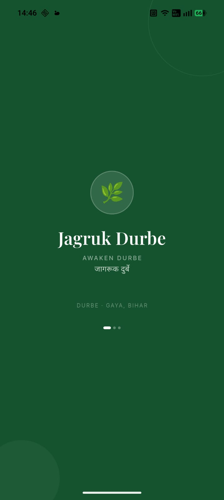
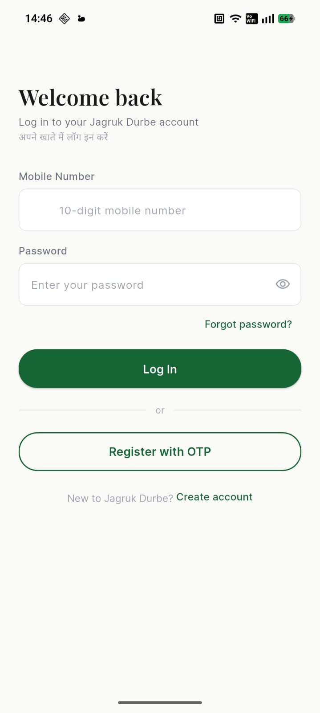
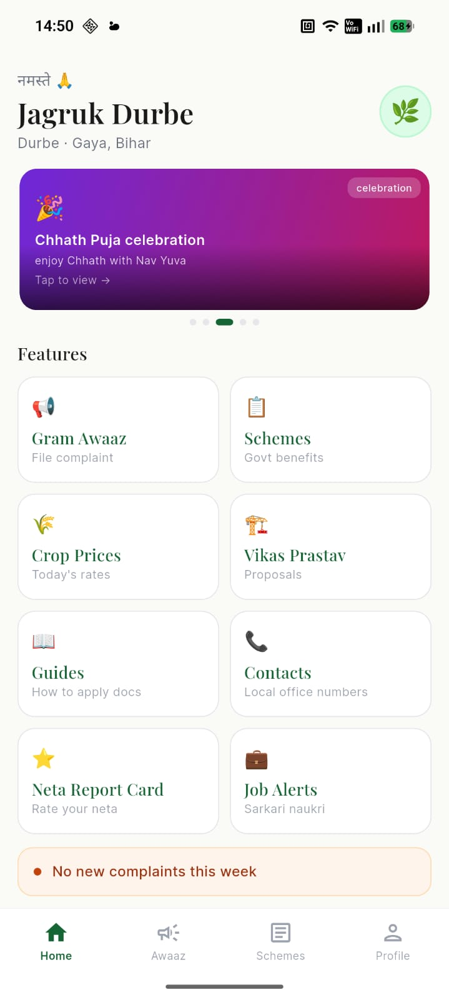
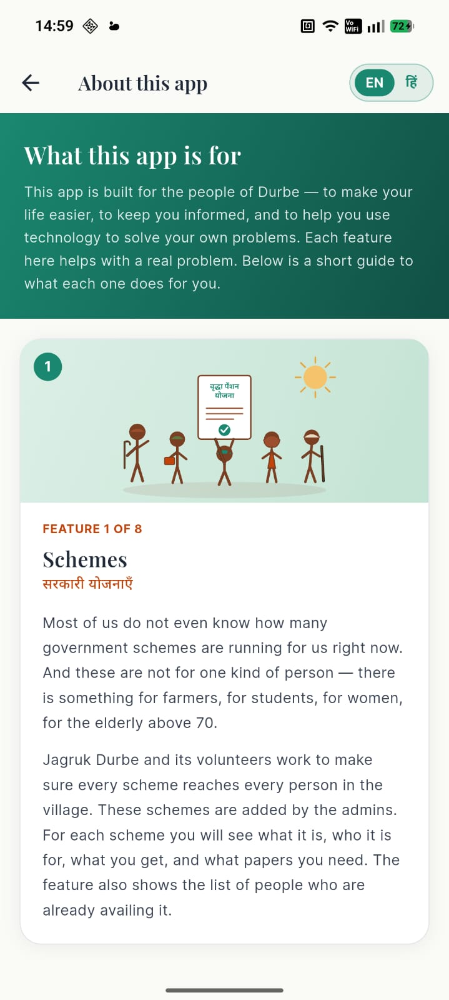
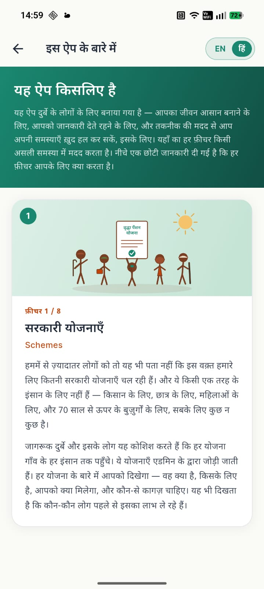
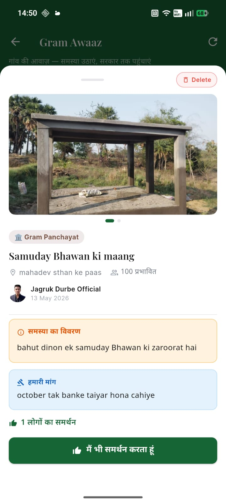
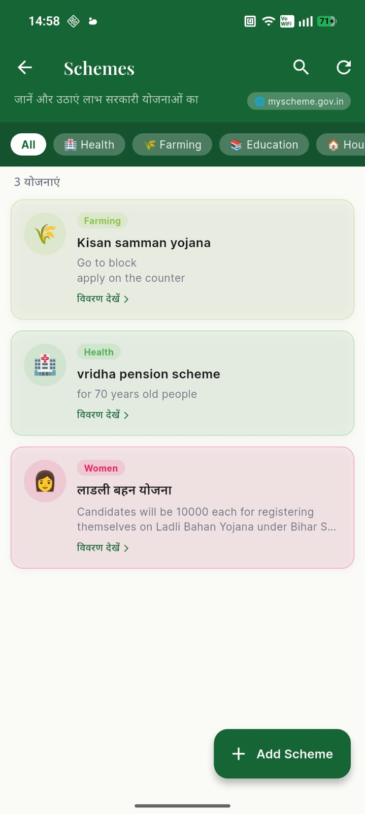
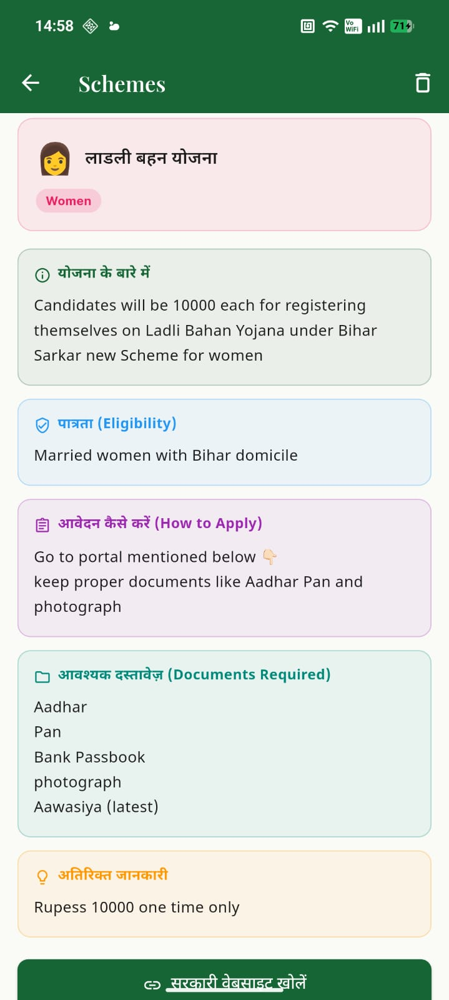
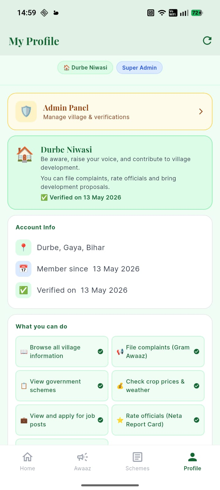
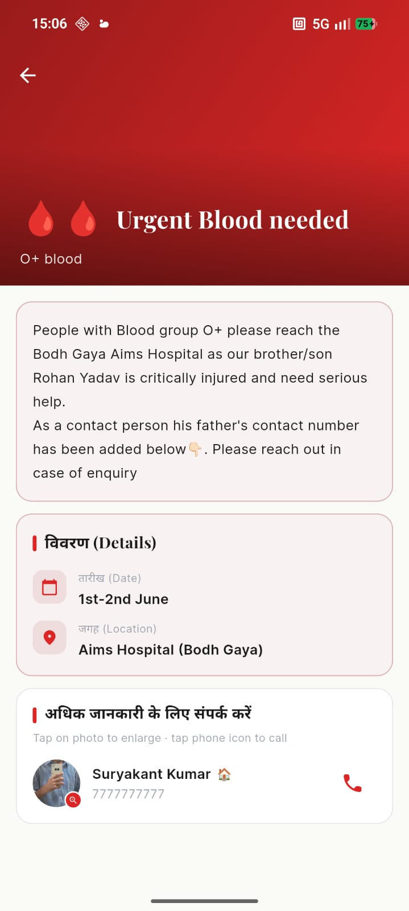

# Jagruk Durbe — Frontend

> **An end-to-end accountability platform for rural India — built to shift villagers from passive recipients of broken promises to informed citizens with evidence, voice, and pressure.**


---

## A Word Before You Read

This is the mobile app for **Jagruk Durbe**, a civic-tech platform built in service of Durbe village in Gaya, Bihar. The README emphasizes design and product craft. For the API, schema, security model, and engineering rationale, see the **[backend repository](https://github.com/sraushan909713-star/Jagruk-Durbe-backend)**.

The idea took years of living in the village to mature. The build took six months. I am the sole developer — design, code, illustrations, copy, motion, and product decisions.

---

## Screenshots

### Splash & Authentication

| Splash | Login |
|---|---|
|  |  |

Phone-based registration with OTP verification. Forgot-password is a one-tap flow that reuses the same OTP infrastructure.

### Home & the Bilingual About Story

| Home (8-tile grid) | About — English | About — हिंदी |
|---|---|---|
|  |  |  |

The home grid surfaces the eight core modules at one tap each. The About screen carries the project's story — and toggles between English and हिंदी with a simultaneous wipe animation, because rural India isn't monolingual and the design shouldn't pretend it is.

### Core Civic Modules

| Gram Awaaz | Schemes Catalog | Scheme Detail |
|---|---|---|
|  |  |  |

**Gram Awaaz** lets citizens document broken infrastructure with photos and geo-tags. **Schemes** simplifies dense government notifications into one-paragraph eligibility, document checklists, and YouTube walk-throughs.

### Profile & Engagement

| My Profile | Banner |
|---|---|
|  |  |

Profile carries identity, role, and account controls. Banners surface time-sensitive village announcements with up to four linked contacts each, in 11 visual themes.

---

## Design System

Every design decision in the app is locked into a single source of truth — `lib/core/theme/app_theme.dart` and `lib/core/constants/`. No hardcoded hex codes are allowed anywhere in feature code.

### Color Palette

| Token | Hex | Use |
|---|---|---|
| Primary green | `#166534` | Brand, primary actions, headers |
| CTA terracotta | `#C2440A` | Primary CTAs, alert accents |
| Background | `#FAFAF7` | Soft off-white app background |
| Card border | `#E5E7EB` | Card outlines, dividers |

Green is the color of growth, of the paddy fields around Durbe. Terracotta is the color of the soil and of the clay homes — chosen specifically so that a villager opening the app feels their landscape, not Silicon Valley's.

### Typography

| Family | Use |
|---|---|
| **Playfair Display** | Headings, hero titles, brand moments |
| **Inter** | Body, lists, forms |
| **Noto Sans Devanagari** | All Hindi (हिंदी) text |

Three fonts, three purposes — Playfair for gravitas, Inter for clarity, Noto Sans Devanagari for Hindi rendering that handles conjuncts and matras properly (no broken glyphs, no fallback embarrassment).

### Cards

White cards with `#E5E7EB` borders, rounded 16–20px corners. Used consistently across every feature screen so the visual rhythm of the app stays calm.

---

## Bilingual UX — EN ↔ हिंदी

The About screen is the place where the app's identity is most explicit, and it is the place where bilingual support is most deliberate:

- **Two-letter toggle** — `EN | हि` — that anyone can find without reading
- **Simultaneous wipe** across all content blocks, 950ms duration, zero stagger between blocks
- **Locked translations** — every line was hand-translated by me, never machine-translated
- **The grandfather tribute** is kept in English only — a small intentional break, because the tribute was written in English and forcing a translation would diminish it

The welcome cards (4-screen onboarding) and the cinematic welcome storyline (see below) are both fully bilingual with locked copy.

---

## The Cinematic Welcome

When a user opens the app for the first time, they don't see a login form. They see a 24-second cinematic storyline that explains, scene by scene, what the app is for.

The flow:

1. **Welcome Cards** — 4 illustrated cards introducing Jagruk Durbe (sunrise over Durbe → three villagers working → a citizen with action bubbles → group celebration)
2. **Cinematic Welcome** — 4 before/after scenes:
   - Gram Awaaz: broken road → fixed road
   - Vikas Prastav: empty Panchayat Bhawan → public library
   - Crop Prices: confused farmer → informed farmer
   - Schemes: lost paperwork → guided application
3. **Closing beat** — Letter-by-letter reveal of **JAGRUK DURBE** with a sunrise glow

Each scene shows the BEFORE state, an arrow, a one-line caption, and the AFTER state — stacked at a 5:2:5 flex ratio for a deliberate visual cadence. Every illustration is a custom SVG made for this app.

The first-launch routing is gated by a device-local `has_seen_welcome` flag (deliberately device-global, not per-user, because OTP-only auth makes per-user state unreliable across re-logins).

---

## Tech Stack

| Layer | Technology |
|---|---|
| Framework | Flutter (Android) |
| Language | Dart |
| State | StatefulWidget + lightweight providers |
| HTTP | `http` package via a centralized `ApiService` |
| Auth storage | `shared_preferences` for JWT + first-launch flag |
| Photo capture | `image_picker` (camera + gallery, 4-slot photo grid) |
| Image upload | Backend-mediated signed Cloudinary upload (multipart + MIME) |
| Image display | Cloudinary URL transforms applied at render-time |
| SVG | `flutter_svg` for every custom illustration |
| Typography | `google_fonts` (Playfair Display, Inter, Noto Sans Devanagari) |
| Tap-to-call | `url_launcher` |
| Multipart MIME | `http_parser` for Android-strict MediaType headers |

### The Cloudinary URL Helper

Every Cloudinary image URL in the app is passed through `lib/core/utils/cloudinary_url.dart` before rendering. The helper injects transformation parameters — `w_X,c_fill,q_auto,f_auto` — directly into the URL path, so Cloudinary returns the optimally compressed, optimally formatted image for the requested size. This cuts image bytes by 60–80% at display time, which matters on rural 4G.

The helper has four flavors: `avatar()` for circles, `thumb()` for card feeds, `full()` for photo viewers, `optimized()` for everything else. It auto-skips non-Cloudinary URLs and URLs that are already transformed, so it's idempotent.

---

## Project Structure

```
lib/
├── core/
│   ├── constants/
│   │   └── app_constants.dart        # App name, base URL, asset paths
│   ├── network/
│   │   ├── api_service.dart          # Every API call lives here, named per endpoint
│   │   └── cloudinary_service.dart   # Backend-mediated photo upload
│   ├── theme/
│   │   └── app_theme.dart            # Single source of truth: colors + fonts
│   └── utils/
│       └── cloudinary_url.dart       # Display-time image optimization helper
│
├── features/
│   ├── about/
│   │   └── screens/
│   │       ├── about_screen.dart             # Bilingual story, grandfather tribute
│   │       ├── welcome_cards_screen.dart     # 4-card onboarding (EN+HI)
│   │       └── cinematic_welcome_screen.dart # 24s before/after storyline
│   ├── auth/
│   │   ├── providers/
│   │   └── screens/                  # Login, Register (OTP), Forgot Password, Splash
│   ├── home/
│   │   └── screens/                  # 8-tile home grid, leaf-logo About entry
│   ├── gram_awaaz/                   # Citizen reporting (photo + geo + upvote)
│   ├── vikas_prastav/                # Development proposals
│   ├── neta_report_card/             # Representative ratings + promises
│   ├── schemes/                      # Govt scheme catalog + community members
│   ├── guides/                       # Documentation walkthroughs
│   ├── contacts/                     # Officials + service providers, tap-to-call
│   ├── mandi_prices/                 # Mandi v2 — items, units, buy/sell modes
│   │   ├── models/
│   │   ├── screens/
│   │   └── widgets/
│   ├── job_alerts/                   # Sarkari Naukri + private jobs
│   ├── banners/                      # Themed announcements with linked contacts
│   ├── profile/                      # User profile + admin panel
│   └── weather/                      # Rain alerts
│
├── shared/
│   └── widgets/                      # Reusable widgets across features
│
└── main.dart
```

**Architectural principle: feature-first.** Every feature is a self-contained folder with its own `screens/`, `models/`, and `widgets/`. Cross-cutting code lives in `core/` and `shared/`. Nothing in a feature reaches into another feature — they only talk through `ApiService` and shared widgets.

**HTTP convention: every endpoint gets a named method on `ApiService`.** No generic `get()` or `post()` helpers exist. If a screen needs `/gram-awaaz/123`, it calls `ApiService.fetchGramAwaazDetail(123)`. This trades a little verbosity for a lot of grep-ability — finding every caller of an endpoint is one search away.

---

## Getting Started

### Prerequisites

- Flutter 3.x (Dart 3.x)
- Android Studio (or VS Code with Flutter plugin)
- A running instance of the [Jagruk Durbe backend](https://github.com/sraushan909713-star/Jagruk-Durbe-backend)

### Setup

```bash
# 1. Clone
git clone https://github.com/sraushan909713-star/Jagruk-Durbe-frontend.git
cd Jagruk-Durbe-frontend

# 2. Install dependencies
flutter pub get

# 3. Configure the backend URL
# Edit lib/core/constants/app_constants.dart
# Set baseUrl to your local backend (e.g. http://192.168.0.3:8000)
# On macOS, find your local IP with: ipconfig getifaddr en0

# 4. Run on a connected device or emulator
flutter run
```

### Test Credentials

For development testing against a freshly seeded backend:

```
Phone:    1234567890
Password: pass123
Role:     super_admin
```

---

## Feature Map — 8-Tile Home Grid

The home screen surfaces the eight most-used modules. Tap order is deliberate — most-pressing-civic first, then services, then opportunity:

1. **Gram Awaaz** — Report a broken road, drain, or asset with photos and geo-tag
2. **Schemes** — Discover government schemes you qualify for
3. **Mandi Prices** — Today's buy/sell rates from local vendors
4. **Vikas Prastav** — Propose new use for unused village assets
5. **Guides** — Step-by-step for birth certificates, land records, etc.
6. **Contacts** — Officials and service providers, tap to call
7. **Neta Report Card** — Rate your representatives, track their promises
8. **Job Alerts** — Sarkari Naukri and private opportunities, simplified

The leaf logo at the top of the home grid is tappable — it opens the About screen with the bilingual story and the cinematic welcome rewind.

---

## Roadmap

- [x] **Phone + OTP auth**, login, register, forgot password
- [x] **Bilingual About** with simultaneous wipe animation
- [x] **Welcome cards** (4-screen onboarding) + **Cinematic Welcome** (24s storyline)
- [x] **8-tile home grid** with all core civic modules
- [x] **Photo upload pipeline** through backend with NSFW screening
- [x] **Display-time image optimization** via Cloudinary URL helper
- [x] **Mandi v2** with items + units master tables, buy/sell, tap-to-call
- [x] **Splash + app rename** to Jagruk Durbe across Android manifest
- [ ] **Lint cleanup pass** — `withOpacity → withValues` migration across feature screens
- [ ] **Real logo** to replace the leaf placeholder
- [ ] **App icon** for Play Store
- [ ] **Play Store submission** — internal testing track → closed testing → production
- [ ] **iOS build** — currently Android-only, iOS deferred to V2

---

## What I Built and Why

The hardest part of this app wasn't writing the code. It was **deciding what not to build**.

Every feature had to pass a single test: *does this make a villager more informed, more empowered, or more economically secure?* Features that didn't pass — even features I'd already started — got cut. The Loans module is the most visible example: it was on the original roadmap, and I removed it entirely, because I'd watched too many neighbors fall into debt traps to ship a feature that could nudge anyone closer to one.

The design choices follow the same test:

- **Custom SVG illustrations** instead of stock imagery, so the villagers in the app look like the villagers in the village
- **Three deliberate fonts** instead of a single neutral one, so Hindi gets the dignity of proper rendering and so the brand has gravitas
- **Cinematic onboarding** instead of a feature tour, because the app's value isn't in its features — it's in the *outcome* it enables
- **Bilingual everything** instead of English-first with translation as an afterthought
- **Tap-to-call** wired directly into Contacts and Mandi, because the next step from "I have the number" is "I call them" and the app should make that one tap, not three
- **Banners with linked contacts** instead of plain text announcements, because an announcement without a path to action is just noise
- **Soft-delete and audit trail** in every screen that touches civic data, because accountability data shouldn't be erasable

I built this alone, end-to-end. Every screen, every illustration, every line of copy in two languages, every animation curve, every API call, every commit. There are lint warnings I haven't cleaned up yet, and the real logo is still a placeholder leaf — but the parts that touch a villager's experience are deliberate.

---

## Backend

The FastAPI backend powering this app: **[Jagruk-Durbe-backend](https://github.com/sraushan909713-star/Jagruk-Durbe-backend)**

---

## Author

**Raushan Kumar**

Sole developer of Jagruk Durbe. Built in service of Durbe village, Gaya, Bihar.

LinkedIn: [linkedin.com/in/raushan-kumar-546189224](https://www.linkedin.com/in/raushan-kumar-546189224)

---

## License

MIT — see [LICENSE](LICENSE)

If you find this work useful as a template for civic-tech in other villages, please cite the original. The mission matters more than the code.